# CCBot

[](https://github.com/alexei-led/ccbot/actions/workflows/ci.yml)
[](https://pypi.org/project/ccbot/)
[](https://pypi.org/project/ccbot/)
[](https://pypi.org/project/ccbot/)
[](https://pypi.org/project/ccbot/)
[](LICENSE)
[](https://github.com/astral-sh/ruff)

Control [Claude Code](https://docs.anthropic.com/en/docs/claude-code) sessions from your phone. CCBot bridges Telegram to tmux — monitor output, respond to prompts, and manage sessions without touching your computer.

## Why CCBot?

Claude Code runs in your terminal. When you step away — commuting, on the couch, or just away from your desk — the session keeps working, but you lose visibility and control.

CCBot fixes this. The key insight: it operates on **tmux**, not the Claude Code SDK. Your Claude Code process stays exactly where it is, in a tmux window on your machine. CCBot reads its output and sends keystrokes to it. This means:

- **Desktop to phone, mid-conversation** — Claude is working on a refactor? Walk away and keep monitoring from Telegram
- **Phone back to desktop, anytime** — `tmux attach` and you're back in the terminal with full scrollback
- **Multiple sessions in parallel** — Each Telegram topic maps to a separate tmux window

Other Telegram bots for Claude Code wrap the SDK to create isolated API sessions that can't be resumed in your terminal. CCBot is different — it's a thin control layer over tmux, so the terminal remains the source of truth.

## How It Works

```mermaid
graph LR
  subgraph phone["📱 Telegram Group"]
    T1["💬 Topic: api"]
    T2["💬 Topic: ui"]
    T3["💬 Topic: docs"]
  end

  subgraph machine["🖥️ Your Machine — tmux"]
    W1["⚡ window @0<br>claude ↻ running"]
    W2["⚡ window @1<br>claude ↻ running"]
    W3["⚡ window @2<br>claude ↻ running"]
  end

  T1 -- "text →" --> W1
  W1 -. "← responses" .-> T1
  T2 -- "text →" --> W2
  W2 -. "← responses" .-> T2
  T3 -- "text →" --> W3
  W3 -. "← responses" .-> T3

  style phone fill:#e8f4fd,stroke:#0088cc,stroke-width:2px,color:#333
  style machine fill:#f0faf0,stroke:#2ea44f,stroke-width:2px,color:#333
  style T1 fill:#fff,stroke:#0088cc,stroke-width:1px,color:#333
  style T2 fill:#fff,stroke:#0088cc,stroke-width:1px,color:#333
  style T3 fill:#fff,stroke:#0088cc,stroke-width:1px,color:#333
  style W1 fill:#fff,stroke:#2ea44f,stroke-width:1px,color:#333
  style W2 fill:#fff,stroke:#2ea44f,stroke-width:1px,color:#333
  style W3 fill:#fff,stroke:#2ea44f,stroke-width:1px,color:#333
```



Each Telegram Forum topic binds to one tmux window running one Claude Code instance. Messages you type in the topic are sent as keystrokes to the tmux pane; Claude's output is parsed from session transcripts and delivered back as Telegram messages.

## Features

**Session control**

- Send messages and `/commands` directly to Claude Code (`/clear`, `/compact`, `/cost`, etc.)
- Interactive prompts (AskUserQuestion, ExitPlanMode, Permission) rendered as inline keyboards
- Terminal screenshots — capture the current pane as a PNG image
- Sessions dashboard (`/sessions`) — overview of all sessions with status and kill buttons

**Real-time monitoring**

- Assistant responses, thinking content, tool use/result pairs, and command output
- Live status line with spinner text (what Claude is currently doing)
- MarkdownV2 formatting with automatic plain text fallback

**Session management**

- Directory browser for creating new sessions from Telegram
- Auto-sync: create a tmux window manually and the bot auto-creates a matching topic
- Fresh/Continue/Resume recovery when a session dies
- Message history with paginated browsing (`/history`)
- Persistent state — bindings and read offsets survive restarts

**Extensibility**

- Auto-discovers Claude Code skills and custom commands into the Telegram menu
- Multi-instance support — run separate bots per Telegram group on the same machine
- Configurable via environment variables

## Quick Start

### Prerequisites

- **Python 3.14+**
- **tmux** — installed and in PATH
- **Claude Code** — the `claude` CLI installed and authenticated

### Install

```bash
# Recommended
uv tool install ccbot

# Alternatives
pipx install ccbot                   # pipx
brew install alexei-led/tap/ccbot    # Homebrew (macOS)
```

### Configure

1. Create a Telegram bot via [@BotFather](https://t.me/BotFather)
2. Enable **Topics** in your bot (BotFather > Bot Settings > Groups > Topics in Groups > Enable)
3. Add the bot to a Telegram group that has Topics enabled
4. Create `~/.ccbot/.env`:

```ini
TELEGRAM_BOT_TOKEN=your_bot_token_here
ALLOWED_USERS=your_telegram_user_id
```

> Get your user ID from [@userinfobot](https://t.me/userinfobot) on Telegram.

### Install the session hook

```bash
ccbot hook --install
```

This registers a Claude Code `SessionStart` hook so the bot can auto-track which session runs in each tmux window.

### Run

```bash
ccbot
```

Open your Telegram group, create a new topic, send a message — a directory browser appears. Pick a project directory and you're connected to Claude Code.

## Documentation

See **[docs/guides.md](docs/guides.md)** for CLI reference, configuration, upgrading, multi-instance setup, session recovery, and more.

## Credits

CCBot is a maintained fork of [ccbot](https://github.com/six-ddc/ccbot) by [six-ddc](https://github.com/six-ddc). See [FORK.md](FORK.md) for the fork history and divergences.

## License

[MIT](LICENSE)
